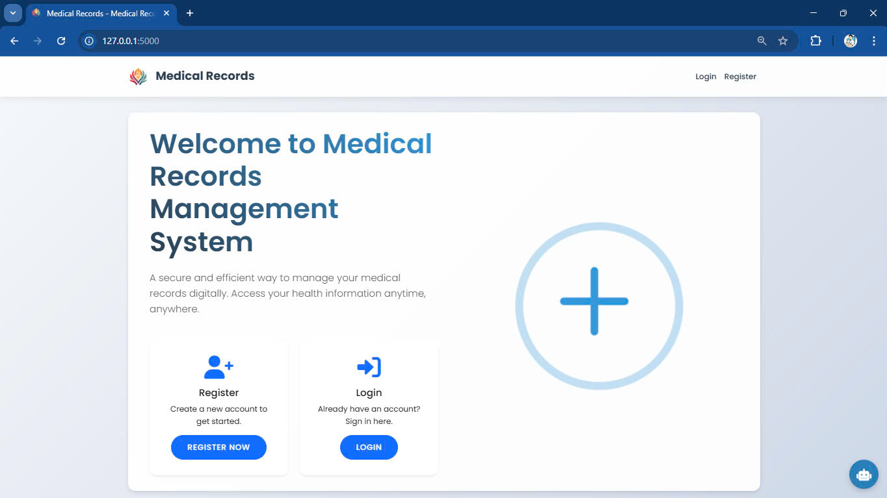

<div align="center">

# **Medical Records**


</div>

## **Thành viên nhóm**
- **Thành viên 1:** Trương Công Đạt - 22685561
- **Thành viên 2:** Nguyễn Gia Lâm - 22685611
- **Thành viên 3:** Phan Tấn Tài - 22684181
## **1. Tổng Quan**

**Medical Records** là một nền tảng web toàn diện giúp bệnh nhân, bác sĩ quản lý các bảng ghi lại một số chỉ sô quan trọng có trong các phiếu xét nghiệm máu để tiện theo dõi. Hệ thống cho phép:

* Bệnh nhân **xem và thêm kết quả xét nghiệm máu** trong môi trường an toàn
* Bác sĩ **tìm kiếm, xem xét các bản ghi** và gửi thông báo đến bệnh nhân
* Quản trị viên **quản lý tài khoản người dùng** và quyền hạn hệ thống

Ngoài ra, người dùng còn có thể giao tiếp với AI của Gemini về các vấn đề liên quan đến lĩnh vực y tếtế
Nền tảng có giao diện thích ứng với khả năng trực quan hóa dữ liệu để theo dõi các chỉ số sức khỏe theo thời gian.

## **2. Công Nghệ Sử Dụng**

* **Backend**: Flask
* **Frontend**: Bootstrap, Plotly.js cho trực quan hóa dữ liệu
* **Cơ sở dữ liệu**: SQLite
* **Xác thực**: Flask-Login
* **Môi trường ảo**: Python venv


---

## **3. Tính Năng Chính**

### **3.1. Tính Năng Cho Bệnh Nhân**

✅ **Quản lý tài khoản**:
* Đăng ký, đăng nhập và cập nhật thông tin cá nhân

✅ **Danh sách bản ghi**:
* Thêm các bản ghi mới
* Xem lại dữ liệu đã ghi trước đó
* Trực quan hóa sự biến động của từng chỉ số bằng biểu đồ đường

✅ **Thông báo**:
* Nhận và quản lý thông báo từ bác sĩ
* Có đánh dấu thông báo đã đọc hay thông báo số lượng thông báo chưa đọc

✅ **Tìm kiếm các thông tin của bác sĩ sử dụng web để có thể liên lạc nếu cần**.
### **3.2. Tính Năng Cho Bác Sĩ**

✅ **Quản lý bệnh nhân**:
* Tìm kiếm bệnh nhân trong hệ thống và thông tin của bệnh nhân để tiện liên lạc.
* Xem các bản ghi của bệnh nhân : Xem dưới dạng bảng ghi thông thường hay dạng đồ thị
* Tải xuống dữ liệu bệnh nhân dưới dạng CSV

✅ **Giao tiếp**:
* Gửi thông báo đến bệnh nhân

### **3.3. Tính Năng Cho Quản Trị Viên**

✅ **Quản lý người dùng**:
* Xem danh sách các tài khoản người dùng tham gia sử dụng trang web
* Cập nhật vai trò người dùng (bệnh nhân, bác sĩ, quản trị viên)
* Đặt lại mật khẩu người dùng
---

## **4. Cấu Trúc Cơ Sở Dữ Liệu**

### **4.1. Bảng Người Dùng**

| Trường            | Kiểu     | Mô tả                                               |
| ----------------- | -------- | --------------------------------------------------- |
| id                | Integer  | Khóa chính                                          |
| username          | String   | Tên đăng nhập duy nhất                              |
| email             | String   | Địa chỉ email người dùng                            |
| password_hash     | String   | Mật khẩu đã mã hóa                                  |
| phone             | String   | Số điện thoại liên hệ                               |
| full_name         | String   | Họ tên đầy đủ                                       |
| avatar            | String   | Đường dẫn ảnh đại diện                              |
| role              | String   | Vai trò người dùng (bệnh nhân/bác sĩ/quản trị viên) |
| reset_code        | String   | Mã xác minh đặt lại mật khẩu                        |
| reset_code_expiry | DateTime | Thời gian hết hạn mã đặt lại                        |

### **4.2. Bảng Hồ Sơ Y Tế**

| Trường      | Kiểu     | Mô tả                     |
| ----------- | -------- | ------------------------- |
| id          | Integer  | Khóa chính                |
| patient_id  | Integer  | Khóa ngoại đến Người dùng |
| date        | DateTime | Ngày ghi nhận             |
| hgb         | Float    | Mức hemoglobin            |
| rbc         | Float    | Số lượng hồng cầu         |
| wbc         | Float    | Số lượng bạch cầu         |
| plt         | Float    | Số lượng tiểu cầu         |
| hct         | Float    | Hematocrit                |
| glucose     | Float    | Đường huyết               |
| creatinine  | Float    | Mức creatinine            |
| alt         | Float    | Alanine transaminase      |
| cholesterol | Float    | Mức cholesterol           |
| crp         | Float    | Protein C-phản ứng        |

### **4.3. Bảng Thông Báo**

| Trường     | Kiểu     | Mô tả                     |
| ---------- | -------- | ------------------------- |
| id         | Integer  | Khóa chính                |
| patient_id | Integer  | Khóa ngoại đến Người dùng |
| message    | Text     | Nội dung thông báo        |
| date       | DateTime | Ngày thông báo            |
| read       | Boolean  | Trạng thái đã đọc         |

### **4.4. Bảng Lịch Sử Trò Chuyện Với AI**

| Trường      | Kiểu     | Mô tả                  |
| ----------- | -------- | ---------------------- |
| id          | Integer  | Khóa chính             |
| sender_id   | Integer  | ID người gửi           |
| receiver_id | Integer  | ID người nhận          |
| message     | Text     | Nội dung tin nhắn      |
| is_read     | Boolean  | Trạng thái đã đọc      |
| created_at  | DateTime | Thời gian gửi tin nhắn |

---

## **5. Quy Trình Hệ Thống**

### **5.1. Quy trình đối với người dùng có vai trò bệnh nhân**

1️⃣ Đăng ký và tạo tài khoản

2️⃣ Thêm kết quả xét nghiệm máu

3️⃣ Xem dữ liệu lịch sử và biểu đồ trực quan

4️⃣ Nhận thông báo từ bác sĩ

5️⃣ Tìm kiếm thông tin của bác sĩ

### **5.2. Quy trình đối với người dùng có vai trò bác sĩ**

1️⃣ Đăng nhập với thông tin bác sĩ

2️⃣ Tìm kiếm bệnh nhân cụ thể

3️⃣ Xem xét các bản ghi của bệnh nhân

4️⃣ Gửi thông báo hoặc khuyến nghị

5️⃣ Tải xuống dữ liệu bệnh nhân để phân tích thêm

### **5.3. Quy trình đối với người dùng có vai trò quản trị viên**

1️⃣ Quản lý tài khoản người dùng và quyền hạn

2️⃣ Cập nhật vai trò người dùng khi cần

3️⃣ Đặt lại mật khẩu cho người dùng
---

## **6. Cấu Trúc Dự Án**

```
medical-records/
├── app/                    # Thư mục chính của ứng dụng
│   ├── __init__.py        # Khởi tạo ứng dụng Flask
│   ├── config.py          # Cấu hình ứng dụng
│   ├── models/            # Các model cơ sở dữ liệu
│   │   ├── user.py        # Model người dùng
│   │   ├── medical_record.py # Model hồ sơ y tế
│   │   └── chat_history.py # Model lịch sử chat
│   ├── forms/             # Các form xử lý dữ liệu
│   │   ├── __init__.py    # Khởi tạo forms
│   │   ├── auth_forms.py  # Form xác thực
│   │   ├── admin_forms.py # Form quản trị
│   │   ├── doctor_forms.py # Form bác sĩ
│   │   └── patient_forms.py # Form bệnh nhân
│   └── routes/            # Các route xử lý request
│       ├── auth.py        # Route xác thực
│       ├── admin.py       # Route quản trị
│       ├── doctor.py      # Route bác sĩ
│       ├── patient.py     # Route bệnh nhân
│       └── chat_ai.py     # Route chat AI
├── static/                # Tài nguyên tĩnh
│   ├── images/           # Hình ảnh
│   └── uploads/          # Thư mục lưu file upload
├── templates/             # Template HTML
│   ├── admin_users.html   # Quản lý người dùng của quản trị viên
│   ├── base.html         # Template cơ sở
│   ├── doctor_dashboard.html # Trang chủ của bác sĩ
│   ├── home.html         # Trang chủ
│   ├── index.html        # Trang chính
│   ├── login.html        # Trang đăng nhập
│   ├── new_record.html   # Thêm bản ghi mới
│   ├── notifications.html # Thông báo người dùng
│   ├── profile.html      # Hồ sơ người dùng
│   ├── register.html     # Trang đăng ký
│   ├── reset_password.html # Đặt lại mật khẩu
│   ├── reset_password_request.html # Yêu cầu đặt lại mật khẩu
│   ├── search_patient.html # Tìm kiếm bệnh nhân
│   ├── view_charts.html  # Trực quan hóa dữ liệu
│   ├── view_doctors.html # Xem danh sách bác sĩ
│   └── view_records.html # Xem hồ sơ bệnh nhân
├── instance/             # Thư mục chứa dữ liệu cục bộ
│   └── medical_records.db # Database SQLite
├── app.py                # File chạy ứng dụng
├── requirements.txt      # Các package cần thiết
└── .gitignore           # File cấu hình Git
```
## **7. Cài Đặt và Thiết Lập**

1. Clone repo:
```
git clone https://github.com/iuh-application-development/Medical-Records.git
```
```
cd .\Medical-Records\
```
2. Tạo môi trường ảo:
```
python -m venv venv
```
3. Kích hoạt môi trường ảo:
- Đối với Windows:
```
venv\Scripts\activate
```
- Đối với Linux/Mac:
```
source venv/bin/activate
```
4. Cài đặt các gói phụ thuộc:
```
pip install -r requirements.txt
```
5. Chạy ứng dụng:
```
python run.py
```
## Link dự án đã triển khai bằng nền tảng Render : [**Medical Record**](https://medical-records-pzlf.onrender.com/)

---


